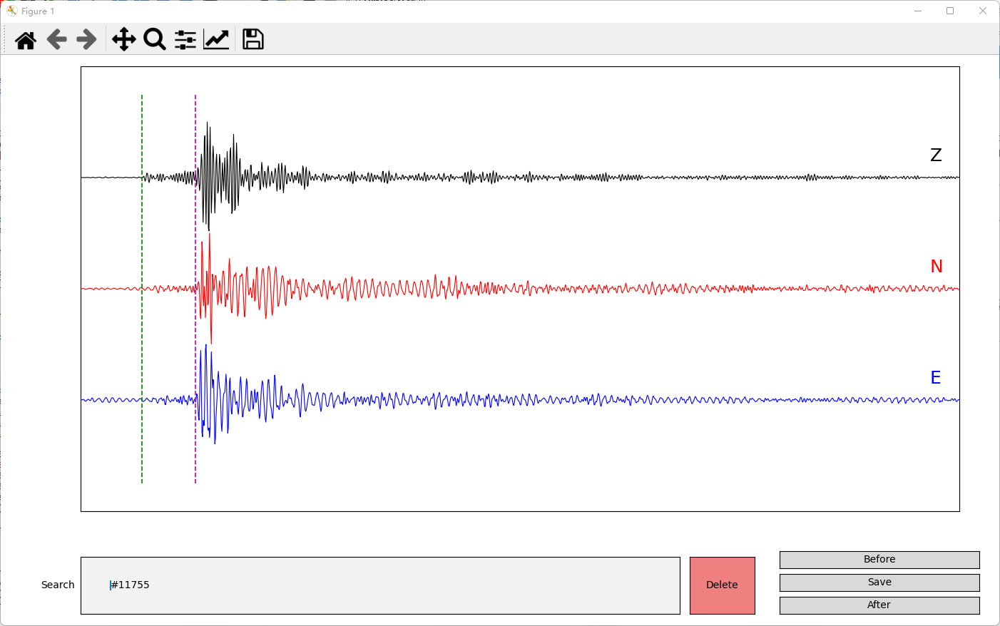

# A simple seismic manual phase picking tool based on matplotlib

A easy-to-deploy program for python users to pick seismic events.

Events are saved as npz files, key word: 

* data: three component earthquake time series
* Parr: P-arrival, unit: second
* Sarr: S-arrival, unit: second
* fs: sampling rate

Basic functions:

* Pick P- phase by click the left mouse button
* Pick S- phase by click the right mouse button
* Zoom in/out the waveforms by scrolling mouse
* Search for event by typing the npz name (without '.npz')
* Change the current picking event by the 'Before' and 'After' button
* Save pick results by the 'Save' button
* Delete unwanted events by the 'delete' button
